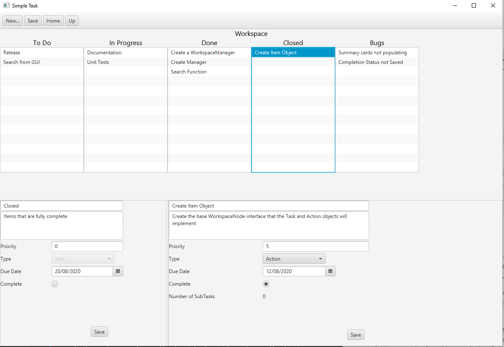

# SimpleTasks



## Summary

SimpleTasks is a task managing app. It was made as a learning exercise, while trying to follow best practices (TTD, documenting code, conforming to a codestyle etc.). The GUI is made using JavaFX and unit tests use the Junit5 framework.

All items are represented by the abstract class `WorkspaceNode`. Items include `Task` (which can have sub tasks) and `Action` (which cannot). This hierarchy was designed to get some practice using abstract classes.

The `WorkspaceManager` is a singleton class that manages the workspace. It maintains a root node that will be the top level of the workspace. All other items are subtasks of this root node. If anything needs data from the workspace (e.g. the GUI will need to know what the name/description/duedate etc. of an item) it will need to ask the `WorkspaceManager`. The `WorkspaceManager` will then wrap this data into a `NodeData` object and pass that to the querying object. This was done so that no class but the `WorkspaceManager` could access the workspace, ensuring that nothing unexpected happens to it.

The GUI displays the top 3 levels of the workspace. This means that it doesn't need to know about the whole workspace, just the current workspace and it's children.

## Features

The current implemented features are:

1. Save and load workspaces from a given location
2. Add Tasks and Actions
3. Delete Tasks and Actions
4. All items can have a name, description, due date and priority
5. Navigation through double clicking or buttons
6. Drag and Drop items between tasks

## Usage

This project depends of [JavaFX](https://openjfx.io/) and [Junit5](https://junit.org/junit5/).

To compile, run

```ps
$src=Get-ChildItem -Filter "*.java" -Recurse -File -Name
javac -cp bin/ -cp PATH_TO_JUNIT `
    --module-path PATH_TO_JAVAFX `
    --add-modules javafx.controls,javafx.fxml `
    -d bin/ $src
```

To run,

```ps1
java -cp bin `
    --module-path PATH_TO_JAVAFX `
    --add-modules javafx.controls,javafx.fxml `
    simpletask.main.app.AppGUI
```

both on Windows.

## Objects

### WorkspaceNode

The basic starting block for any object that is to be managed by the [Workspace Manager](#workspacemanager). It contains all the required fields that a node may need, name, description, due date etc.

### Task

Extends [WorkspaceNode](#workspacenode). This object will maintain a list of other WorkspaceNodes. It can move them and create other nodes. The main use of these types of nodes is for grouping similar tasks together. For example, todo, in progress, assignment 1, sprint 3 etc.

### Action

Extends [WorkspaceNode](#workspacenode). This object represents a singular action that cannot be broken down into more sub tasks. It is a very simple implementation of a node that does not maintain any tasks.

### WorkspaceManager

Manages the workspace. The workspace consists of a root [WorkspaceNode](#workspacenode), generally a [Task](#task), but it does not need to be. All interaction by GUI's or other external processes are done through the manager. It maintains two nodes, the root node and the current node. The root node is the top level node and should not change (I think). While the current node represents the node that the manager is currently managing. i.e. if you add another node, it will be added to the current node.
